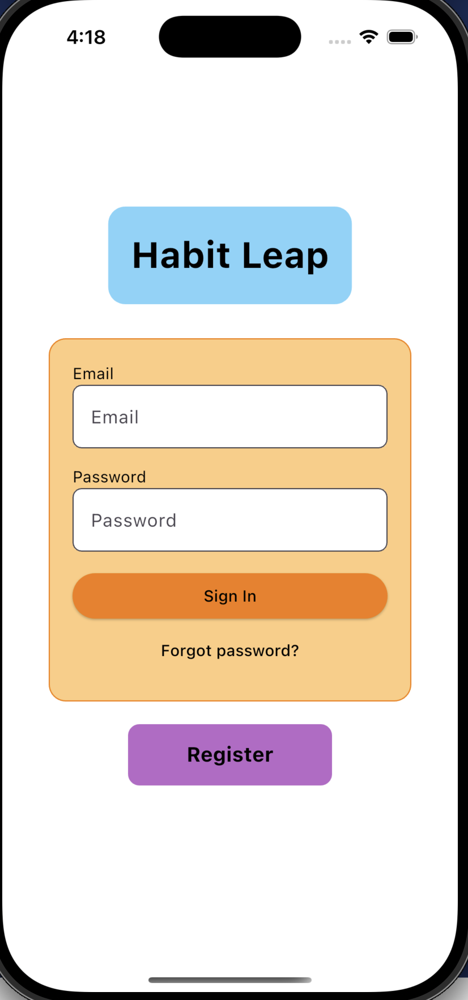
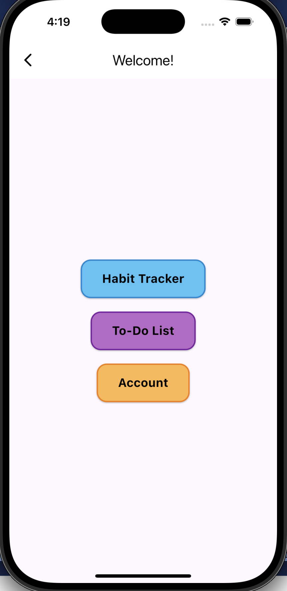
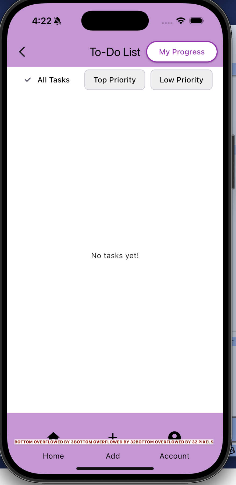

# 📈 HabitLeap – Habit Tracking App

HabitLeap is a cross-platform habit tracking app built with Flutter that helps users build and maintain daily habits.

## 🚀 Features
- Create and manage habits
- Track completion status daily
- View habit progress and statistics
- Filter habits by day or category
- Persistent data storage using Sembast

## 🛠️ Tech Stack
- Flutter & Dart
- Sembast (cross-platform database)
- Clean UI focused on usability
- Local data persistence

## 📱 Screens
- Dashboard (habit overview)
- Add Habit
- Daily Tracking
- Progress View

## 💡 What I Learned
- Structuring a scalable Flutter app
- Designing user-friendly interfaces
- Working with local databases (Sembast)
- Implementing CRUD operations efficiently

## 🔗 Future Improvements
- Notifications/reminders
- Cloud sync
- User accounts
- Data visualization improvements

## 📸 Screenshots

